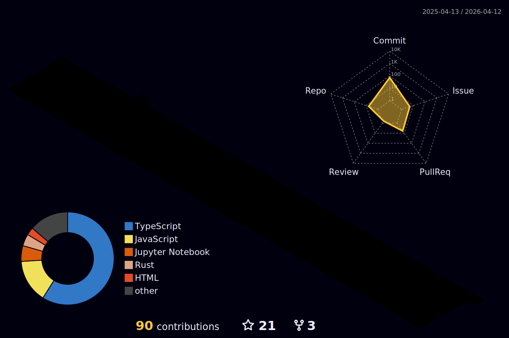

<!--
**defunSM/defunSM** is a ✨ _special_ ✨ repository because its `README.md` (this file) appears on your GitHub profile.

Here are some ideas to get you started:

- 🔭 I’m currently working on ...
- 🌱 I’m currently learning ...
- 👯 I’m looking to collaborate on ...
- 🤔 I’m looking for help with ...
- 💬 Ask me about ...
- 📫 How to reach me: ...
- 😄 Pronouns: ...
- ⚡ Fun fact: ...
-->
### Hi 👋, My name is Salman

- 🌱 I’m currently learning about large language models, SQL, homelab and drone photography.
- 📫 How to reach me: salmanhossain500@gmail.com

Skills: Python / JavaScript 

  

